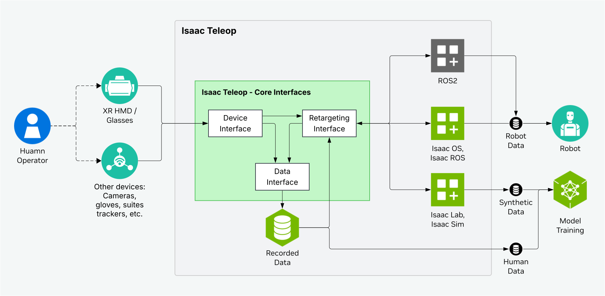

.. SPDX-FileCopyrightText: Copyright (c) 2026 NVIDIA CORPORATION & AFFILIATES. All rights reserved.
.. SPDX-License-Identifier: Apache-2.0

Architecture
============

Isaac Teleop is the unified framework for high-fidelity egocentric and robotics data collection. It
streamlines device integration, standardizes human demo data collection, and fosters device and data
interoperability.

   **Figure:** Isaac Teleop high-level architecture

The core components of Isaac Teleop are:

Unified Device Interface
------------------------

- Support for major XR headsets, including Apple Vision Pro, Pico, Quest, and others
- Seamless integration of USB and Bluetooth peripherals (e.g., gloves, pedals, body trackers)
- Extensible interface enabling vendors to add custom or proprietary devices
- Consistent timestamping for multi-device streams, synchronized via unified device input control loop

Retargeting Interface
---------------------

- Tensor in, tensor out, GPU acceleration ready
- Reuse schema from the data interface
- Handle both a single data point, or an entire trajectory

Data Interface
--------------

- Standardized `data schema <https://github.com/NVIDIA/IsaacTeleop/tree/main/src/core/schema/fbs>`_ defined in the FlatBuffers (fbs) format.
- Data recording & playback with `mcap <https://mcap.dev/>`_
- Dataset interoperability with `LeRobot <https://github.com/huggingface/lerobot>`_
